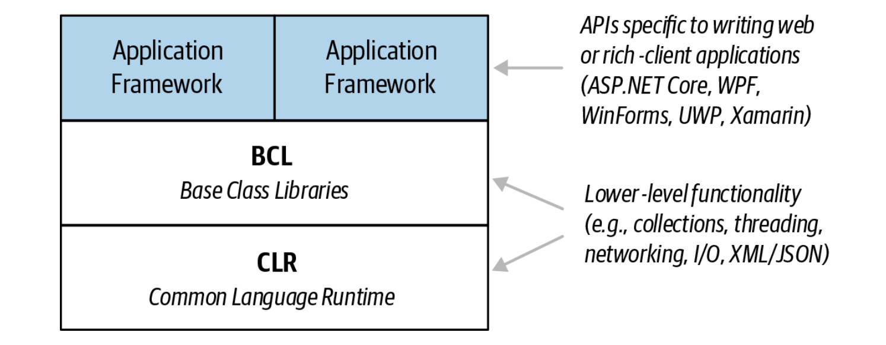
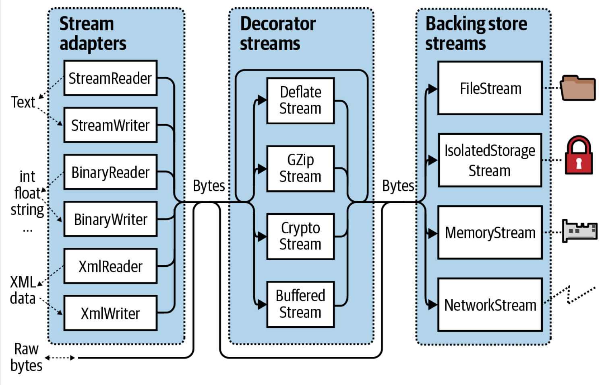

# .NET

* Common Language Runtime
  * Intermediate Language (IL)
  * Managed language
  * Managed code
  * Just-In-Time (JIT)

___

* Frameworks and Base Class Libraries
  * The Base Class Libraries (BCL)
  * Application framework layers
  * .NET Standard

    

___

* Data Types and Memory Allocation
  * Value Types
  * Reference Types
  * double Versus decimal
  * Stack
  * Heap

___

* Local method
* CLR behind the scene implementations
* new versus override
* Initialization order
* Boxing and unboxing
* Struct
* Ref Structs
* Friend Assemblies
* Interface implementations
* Enum Type-Safety Issues

___

* Generics
  * Constraints
  * Covariance
  * Contravariance

___

* Events
* Delegate
  * Parameter compatibility
  * Return type compatibility
  * Generic delegate type

___

* Lambda Expressions
  * Closures
  * Captured variables
  * Expression tree
  * Lambda Expressions Versus Local Methods

___

* `try` Statements and Exceptions
* Enumeration and Iterators
* The `Array` Class
* `Nullable<T>` Struct
* Nullable Reference Types
* Extension Methods
* Anonymous Types
* Tuple and ValueTuple

___

* Patterns
  * Property Patterns
  * Tuple Patterns
  * Positional Patterns
  * `var` Patterns
  * Constant Patterns

___

* Caller Info Attributes
  * CallerMemberName
  * CallerFilePath
  * CallerLineNumber

___

* Dynamic Binding
* Unsafe Code and Pointers

___

* Preprocessor Directives
  * Conditional Attributes

___

* Comparing Strings
  * Equality comparison
  * Order comparison
     * Ordinal versus culture comparison

___

* StringBuilder
* Text Encodings and Unicode

___

* Dates and Times
  * TimeSpan
  * DateTime and DateTimeOffset
  * Time Zones
  * Alternatives

___

* BigInteger
* Complex
* Random
* The `Guid` Struct

___

* Standard Equality Protocols
  * == and !=
  * The virtual object.Equals method
  * The static object.Equals method
  * The static object.ReferenceEquals method
  * The IEquatable<T> interface
  * When Equals and == are not equal
  * Overriding GetHashCode
  * Overriding Equals

___

* Collections
  * BitArray
  * HashSet<T> and SortedSet<T>
  * Dictionaries
  * EqualityComparer<T>

___

* LINQ Query
  * Deferred Execution
  * Subqueries
  * Interpreted Queries

___

* Garbage Collection and Memory Consumption
  * Finalizers
  * How the GC Works
  * Managed Memory Leaks

___

* Cross-Platform Diagnostics Tools
  * dotnet-counters
  * dotnet-trace
  * dotnet-dump

___

* Concurrency and Asynchrony and Threading
  * Concurrency vs Multi-Threading vs Async vs Parallelism
  * Single-core vs multicore or multiprocessor machine
  * Related Data-Structures (ex: ConcurrentDictionary, Channels)
  * Sleep
  * Yield
  * Blocking
  * Spinning
  * Local versus Shared State
  * Passing Data to a Thread
  * Exception Handling
  * Foreground versus Background Threads
  * IAsyncStateMachine
  * IAsyncEnumerable
  * IAsyncDisposable
  * Synchronization Contexts
  * `async void`
  * The Thread Pool
    * Worker Thread vs I/O Thread
  * Tasks
    * Long-running tasks & Task.Run()
    * AggregateException
    * awaiter.GetResult() vs .Result
    * TaskCompletionSource
    * Task.Delay
    * Awaiting
    * Asynchronous call graph execution
    * `ValueTask<T>`
      * Precautions
    * `ConfigureAwait(false)`
    * Cancellation
  * Synchronization
    * Categories
      * Exclusive locking
        * lock Statement
        * Monitor.Enter and Monitor.Exit
        * Choosing the Synchronization Object
        * Deadlocks
        * Performance
        * Mutex
        * Locking and Thread Safety
      * Nonexclusive locking
        * Semaphore and SemaphoreSlim
        * Reader/Writer Locks
      * Signaling
        * AutoResetEvent
        * ManualResetEvent
        * CountdownEvent
        * Barrier Class
    * Lazy Initialization
    * Thread-Local Storage
    * Timers
    * SpinLock and SpinWait
    * Nonblocking synchronization techniques
      * Interlocked
      * memory barriers
      * volatile
    * Monitor.Wait and Monitor.Pulse

___

* Stream Architecture
  * Backing stores
    * FileStream
    * NetworkStream
    * MemoryStream
    * PipeStream
      * Named pipes
      * Anonymous pipes
  * Decorators
    * BufferedStream
    * DeflateStream
    * GZipStream
    * CryptoStream
  * Adapters
    * TextReader
    * TextWriter
    * StreamReader
    * StreamWriter
    * StringReader
    * StringWriter

  

  * Thread Safety
  * `File` and `Directory` class vs `FileInfo` and `DirectoryInfo`
  * Memory-Mapped Files

___

* Network Architecture

  

  * URIs
  * WebClient
  * HttpClient
  * HttpListener
  * TCP and UDP

* Serialization Engines
  * XmlSerializer
  * JsonSerializer
  * The data contract serializer
  * The binary serializer

* Assemblies
  * The Assembly Manifest
  * Resources and Satellite Assemblies
  * assembly loading
  * Assembly resolution
  * Assembly Load Contexts
  * AssemblyDependencyResolver

* Reflection and Metadata
  * `GetType` Method vs `typeof` Operator
  * Obtaining a Type
    * Array types
    * Nested types
  * Type Names
  * Instantiating Types
  * Member Types
  * C# Members versus CLR Members
  * Late binding
  * Using Delegates for Performance
  * Attributes
    * Types
      * Bit-mapped
      * Custom
      * Pseudocustom
    * Properties and constructor parameters constraints

___

* Dynamic Code Generation
  * Generating IL with DynamicMethod
  * Emitting Assemblies and Types

___

* Dynamic Programming
  * Dynamic Language Runtime
  * Call Sites
  * Dynamic Member Overload Resolution
  * Anonymously Calling Members of a Generic Type
  * `ExpandoObject`
  
  ___
  
* Cryptography
  * Hash Algorithms
  * Hashing Passwords
  * Symmetric Encryption
  * Public-Key Encryption and Signing

___

* Parallel Programming
  * Channel
  * Data parallelism and task parallelism
  * PLINQ
  * The Parallel Class
  * Task Parallelism
  * Concurrent Collections
  * BlockingCollection<T>

___

* Span<T> and Memory<T>
  * Spans and Slicing
  * Forward-Only Enumerators

___

* Native and COM Interoperability
  * Calling into Native DLLs
  * The Purpose of COM

___

* Regular Expressions
  * Compiled Regular Expressions
  * Character Escapes
  * Character Sets
  * Quantifiers

___

* The Roslyn Compiler
  * Roslyn Architecture
    * Parsing code into syntax trees (the syntactic layer)
    * Binding identifiers to symbols (the semantic layer)
    * Emitting Intermediate Language (IL)
